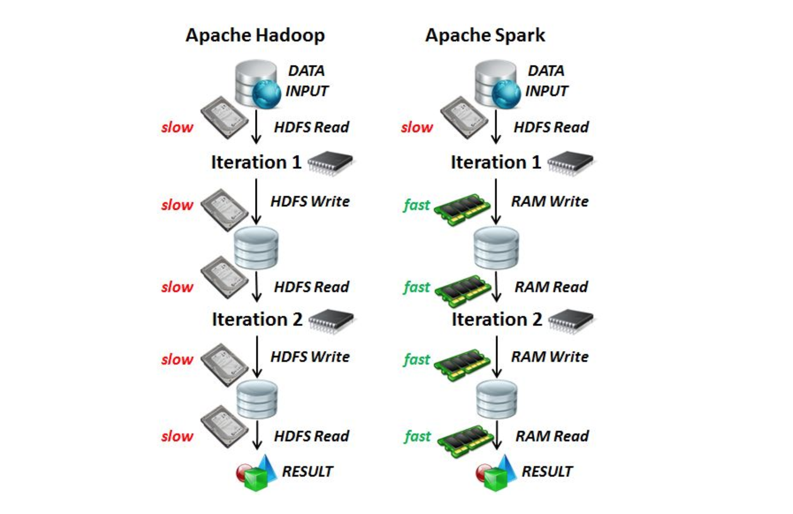
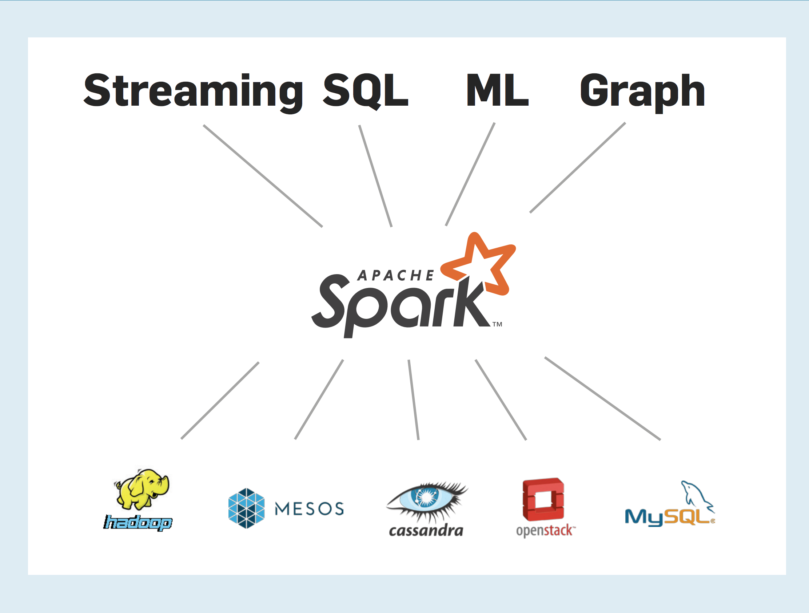

```{r setup, include=FALSE}
knitr::opts_chunk$set(eval = FALSE)
```

## What to do when code is slow?

```{r}
mtcars %>% lm(mpg ~ wt + cyl, .)
```

```{r}
# Sample
mtcars %>% dplyr::sample_n(10) %>% lm(mpg ~ wt + cyl, .)
```

```{r}
# Profile
profvis::profvis(mtcars %>% lm(mpg ~ wt + cyl, .))
```

```{r}
# Scale Up
cloudml::cloudml_train("train.R")
```

```{r}
# Scale Out
mtcars_tbl %>% sparklyr::ml_linear_regression(mpg ~ wt + cyl)
```

*Attribution: [Javier Luraschi's talk slides from SDSS 2019](https://github.com/javierluraschi/talks/tree/master/2019-05-31)*


---

## Scaling up vs scaling out


source: https://hadoop4usa.wordpress.com/2012/04/13/scale-out-up/

---

## Scaling out 

MapReduce (Hadoop) was the original big kid on the block in terms of scaling out.


---

## Reminder of how MapReduce works


source: https://www.edureka.co/blog/mapreduce-tutorial/

---

## Hadoop vs Spark



source: http://www.big-data.tips/apache-spark-vs-hadoop

---

## Choice for scaling out 

Spark's increases in speed and ease of use means there is now a faster and smoother kid on the block...


---

## How/where can you use Spark



source:  [Zaharia et al. (2016). Apache Spark: A Unified Engine For Big Data Processing](https://m-cacm.acm.org/magazines/2016/11/209116-apache-spark/fulltext?mobile=true)

---

## Leading Spark cloud platforms


---

## `sparklyr` + Databricks demo


Notebook 1 - [Install `sparklyr` on Databricks cluster](https://databricks-prod-cloudfront.cloud.databricks.com/public/4027ec902e239c93eaaa8714f173bcfc/122317798088836/2899638924944209/7990734693716546/latest.html)

Notebook 2 - [Analysis demo](https://databricks-prod-cloudfront.cloud.databricks.com/public/4027ec902e239c93eaaa8714f173bcfc/122317798088836/1209097457925280/7990734693716546/latest.html)

---

## Full code from today's demo

[Notebook](https://databricks-prod-cloudfront.cloud.databricks.com/public/4027ec902e239c93eaaa8714f173bcfc/122317798088836/2899638924944155/7990734693716546/latest.html)

